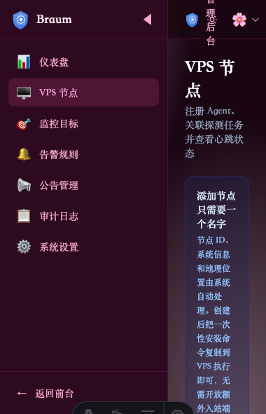

<p align="center">
  
</p>

<h1 align="center">Braum 布隆探针</h1>

<p align="center">
  <strong>Cloudflare 原生 · 零服务器成本 · 全球 VPS 监控与网络探测平台</strong>
</p>

<p align="center">
  <a href="#-快速开始">快速开始</a> •
  <a href="https://github.com/your-org/braum-probe/wiki">文档</a> •
  <a href="#-截图预览">截图</a> •
  <a href="#-对比">对比</a>
</p>

<p align="center">
  
  
  
  
  
  
</p>

<p align="center">
  
</p>

## ✨ 为什么选择 Braum？

| 特性 | Braum | 哪吒探针 | Komari | Uptime Kuma |
|:---|:---:|:---:|:---:|:---:|
| **控制面需要服务器** | ❌ 不需要 | ✅ 需要 | ✅ 需要 | ✅ 需要 |
| **部署成本** | $0 (CF 免费版) | VPS 费用 | VPS 费用 | VPS 费用 |
| **边缘计算** | ✅ Cloudflare 全球节点 | ❌ 单点 | ❌ 单点 | ❌ 单点 |
| **Agent 入站端口** | 0 个（Agent 主动外连） | 需要 | 需要 | 不需要 |
| **HTTP/DNS 本地探测** | ✅ 由 VPS Agent 执行 | ❌ 控制面发起 | ❌ 控制面发起 | ✅ 控制面发起 |
| **告警通知** | ✅ Telegram + Webhook | ✅ 多渠道 | ✅ 邮件/Webhook | ✅ 90+ 渠道 |
| **主题系统** | 4 套 + Dark 模式 | 社区主题 | 可自定义 | 默认主题 |
| **管理后台** | ✅ 内置 RBAC | ✅ 内置 | ✅ 内置 | ✅ 内置 |
| **数据保留** | D1 自动清理 | 手动管理 | 手动管理 | SQLite |

> **核心差异**：其他探针都需要一台 VPS 运行控制面。Braum 的控制面完全运行在 Cloudflare 边缘网络上——D1 数据库、KV 缓存、Workers API、Pages 前端——全部免费。你只需要为被监控的 VPS 安装 Agent。

## 🚀 特性一览

- 🖥️ **VPS 资源监控** — CPU、内存、Swap、磁盘、负载、流量、连接数，Agent 每秒主动上报
- 🔍 **节点本地探测** — HTTP/DNS 任务由 VPS Agent 就近执行，真实反映各地网络质量
- 🔐 **安全注册** — 一次性 15 分钟安装令牌，D1 只存 SHA-256 摘要，密钥永不落盘
- 📊 **状态总览** — 在线状态、资源趋势、延迟热力图、可用率指标
- 🔔 **智能告警** — CPU/内存/磁盘/负载/心跳/延迟/可用率/连续失败，Telegram + Webhook 通知
- 📢 **故障公告** — 维护计划、事件时间线、公开状态页
- 👥 **权限审计** — Owner/Admin/Viewer 三级权限，敏感字段自动脱敏
- 🎨 **四套主题** — 默认 / 樱の物语 / 星海夜航 / 翠灵庭院，独立 Dark 模式开关
- ☁️ **Cloudflare 原生** — Workers + D1 + KV + Pages，零服务器运维，全球边缘加速

## 📸 截图预览

<p align="center">
  <b>状态总览</b><br/>
  <a href="docs/screenshots/dashboard.png"></a>
  <a href="docs/screenshots/admin-nodes.png"></a>
</p>

<p align="center">
  <b>管理后台</b><br/>
  <a href="docs/screenshots/admin-dashboard.png"></a>
  <a href="docs/screenshots/admin-nodes.png"></a>
</p>

## 🏗️ 架构

```text
                        ┌──────────────────────────┐
 浏览器 ── Pages ──────▶│ Cloudflare Worker / Hono │
                        │ 鉴权 · 配置 · 告警 · API │
                        └────────────┬─────────────┘
                                     │
                              ┌──────┴──────┐
                              │ D1      KV  │
                              └─────────────┘
                                     ▲
             HTTPS 主动上报/配置下发 │
            ┌────────────────────────┼──────────────────────┐
      ┌─────┴─────┐            ┌─────┴─────┐          ┌─────┴─────┐
      │ VPS Agent │            │ VPS Agent │          │ VPS Agent │
      │ 东京      │            │ 法兰克福  │          │ 洛杉矶    │
      └─────┬─────┘            └─────┬─────┘          └─────┬─────┘
            └──────── HTTP / DNS 节点本地探测 ──────────────┘
```

- **控制面**（Cloudflare）：无需服务器，Workers 处理 API、D1 存数据、KV 做缓存、Pages 托管前端
- **Agent**（VPS 上）：Go 编写的轻量常驻进程，仅出站 HTTPS，不开入站端口

## 🚀 快速开始

> **你需要**：一个 Cloudflare 账号（免费）+ 一台 VPS。不需要域名，Cloudflare 会给你免费的 `workers.dev` 和 `pages.dev` 地址。

### 第一步：Fork 仓库

打开本仓库 → 右上角 **Fork** → **Create fork**

### 第二步：发布 Agent

Fork 仓库 → **Actions** → 启用工作流 → 左侧 **Agent Release** → **Run workflow** → 等变绿

### 第三步：创建 D1 数据库

Cloudflare 控制台 → **Storage & Databases → D1** → **Create database**
- 名称：`braum-production`
- 复制 **Database ID**

### 第四步：创建 KV

Cloudflare 控制台 → **Storage & Databases → KV** → **Create namespace**
- 名称：`braum-cache`
- 复制 **Namespace ID**

### 第五步：编辑配置

在 GitHub 打开 `apps/api/wrangler.toml` → 点铅笔 ✏️ → 改三处：

```toml
# 改成你的 GitHub 用户名
AGENT_RELEASE_BASE_URL = "https://github.com/你的用户名/braum-probe/releases/latest/download"

# 粘贴 D1 Database ID
database_id = "xxxx-xxxx-xxxx"

# 粘贴 KV Namespace ID
id = "xxxx-xxxx-xxxx"
```

点 **Commit changes** 保存。

### 第六步：部署 Worker（API）

Cloudflare → **Workers & Pages** → **Create** → **Import from Git** → 选你的 Fork 仓库

| 设置 | 值 |
|------|-----|
| Project name | `braum-worker` |
| Build command | `pnpm --filter @braum/shared build` |
| Deploy command | `pnpm --filter @braum/shared build && pnpm --filter @braum/api deploy:full` |
| Node version | `22` |

部署成功后复制 Worker 地址（如 `https://braum-worker.xxx.workers.dev`）。

进入 Worker **Settings → Variables and Secrets**，添加 4 个 **Secret**：

| 名称 | 值 |
|------|-----|
| `JWT_SECRET` | 随机长字符串 |
| `JWT_REFRESH_SECRET` | 另一个随机长字符串 |
| `ENCRYPTION_KEY` | 再一个随机长字符串 |
| `ADMIN_INITIAL_PASSWORD` | 你自己设的登录密码 |

保存后重新 **Deploy** 一次。

### 第七步：部署 Pages（前端）

Cloudflare → **Workers & Pages** → **Create** → **Pages** → **Connect to Git**

| 设置 | 值 |
|------|-----|
| Project name | `braum-web` |
| Build command | `pnpm --filter @braum/shared build && pnpm --filter @braum/web build` |
| Build output | `apps/web/dist` |

Pages **Settings → Variables and Secrets** 添加：

| 名称 | 值 |
|------|-----|
| `PUBLIC_API_URL` | 第六步的 Worker 地址 |

重新部署。最后回 GitHub 再编辑一次 `wrangler.toml`，补上：

```toml
CORS_ORIGINS = "https://braum-web.你的账号.pages.dev"
AGENT_API_URL = "https://braum-worker.你的账号.workers.dev"
```

### 第八步：登录 + 安装 VPS

1. 打开 `https://braum-web.你的账号.pages.dev/admin`
2. 邮箱：`admin@braum.local`，密码：你第六步设的密码
3. 「VPS 节点」→ 添加（只需填名称）→ 复制安装命令
4. SSH 到 VPS 执行那条命令
5. 等 1 分钟，节点上线 ✅

<details>
<summary>📺 部署后你会得到什么？</summary>

| 地址 | 用途 |
|------|------|
| `https://braum-web.xxx.pages.dev` | 公开状态页 |
| `https://braum-web.xxx.pages.dev/admin` | 管理后台 |
| `https://braum-worker.xxx.workers.dev/health` | API 健康检查 |

</details>

> 📖 完整图文教程见 [小白部署指南](docs/小白部署指南.md) · 命令行部署见 [部署运维文档](docs/部署运维文档.md)

### 本地开发

```bash
git clone https://github.com/your-org/braum-probe.git && cd braum-probe
pnpm install && cp .env.example .env
pnpm db:migrate && pnpm db:seed
pnpm dev
```

- 前端：`http://localhost:4321`
- 管理后台：`http://localhost:4321/admin`（`admin@braum.local` / `admin123`）
- API：`http://localhost:8787`

### 添加第一台 VPS

1. 登录 `/admin` → 「VPS 节点」→ 点击「添加节点」
2. 只需填写名称，系统自动生成一次性安装命令
3. 在目标 VPS 上执行安装命令（自动识别架构、校验 SHA-256、创建沙箱服务）
4. 等待 ~1 分钟，节点自动上线

## 📦 项目结构

```
apps/
├── api/          # Cloudflare Worker / Hono 控制面
├── agent/        # Go VPS Agent（轻量常驻进程）
└── web/          # Astro + React 状态页与管理后台
packages/
└── shared/       # TypeScript 跨层共享类型
docs/             # 架构、部署、交互与数据库文档
migrations/       # D1 数据库迁移脚本
```

## 🔒 安全

- **RBAC 权限**：Owner / Admin / Viewer，每次请求从 D1 读取角色状态
- **Agent 密钥**：D1 仅存 SHA-256 摘要，密钥只返回一次
- **通知加密**：渠道配置 AES-GCM 加密，审计日志递归脱敏
- **SSRF 防护**：HTTP 目标保存前执行私网/回环地址检查
- **建议**：管理后台额外使用 Cloudflare Access 保护

## 📖 文档

| 文档 | 说明 |
|:---|:---|
| [部署指南](docs/部署运维文档.md) | 生产环境部署全流程 |
| [架构设计](docs/架构设计文档.md) | 系统架构与 ADR |
| [数据库设计](docs/数据库设计文档.md) | D1 Schema 与迁移 |
| [前端功能](docs/前端功能和交互设计文档.md) | 状态页功能与交互 |
| [管理后台](docs/管理后台功能和设计文档.md) | 后台功能与设计 |
| [UI 规范](docs/UI视觉与交互规范文档.md) | 主题系统与组件规范 |
| [环境变量](docs/环境变量与配置指南.md) | 配置项说明 |

## 🧪 质量

```bash
pnpm test        # Vitest 107 个用例 + Go Agent 测试
pnpm typecheck   # TypeScript 类型检查
pnpm lint        # ESLint + go vet
pnpm build       # 全量构建
```

## 🤝 参与贡献

欢迎 Issue 和 Pull Request！在提交 PR 前请确保：

- `pnpm test` 全部通过
- 新功能附带对应测试用例（项目遵循 TDD）
- 代码风格与现有项目一致

## 📄 协议

[MIT](LICENSE) — 自由使用、修改和分发。

## ⭐ Star History

如果你喜欢这个项目，请给一个 Star 支持！

---

<p align="center">
  <sub>Built with ❤️ on Cloudflare Workers</sub>
</p>
<p align="center">
  
</p>
<h1 align="center">Braum 布隆探针</h1>
<p align="center"><strong>Cloudflare 原生控制面 + 轻量 VPS Agent 的服务器监控与网络探测平台</strong></p>

<p align="center">
  
  
  
  
</p>

Braum 的控制面部署在 Cloudflare Workers、D1、KV 与 Pages 上；每台被监控 VPS 安装一个常驻 Agent。Agent 主动连接 Workers，上报服务器资源，并在 VPS 本地执行 HTTP/DNS 探测，因此不需要开放额外入站端口。

## 核心能力

- **真实 VPS 监控**：CPU、内存、Swap、磁盘、系统负载、累计流量、连接数、进程数和运行时间。
- **安全 Agent 注册**：管理后台生成 15 分钟有效的一次性安装令牌；注册后换取节点专属密钥，D1 只保存摘要。
- **节点本地探测**：HTTP/DNS 任务由对应 VPS Agent 执行，不用 Cloudflare Cron 模拟全球节点。
- **状态总览与详情**：节点在线状态、资源占用、24 小时趋势、延迟、可用率和历史记录。
- **资源与可用性告警**：CPU、内存、磁盘、负载、心跳中断、延迟、可用率和连续失败规则。
- **通知与事件**：Telegram、Webhook 通知，故障公告、维护计划和事件时间线。
- **权限与审计**：Owner/Admin/Viewer、实时账号状态检查、敏感字段递归脱敏。
- **Cloudflare 原生控制面**：无需自行维护中心服务器。

> 远程终端需要独立的短时授权、WebSocket 中继和完整会话审计，目前列为 P1，尚未在 P0 开放。项目不会用永久 Agent 心跳密钥直接建立浏览器终端。

## 架构

```text
                        ┌──────────────────────────┐
 浏览器 ── Pages ──────▶│ Cloudflare Worker / Hono │
                        │ 鉴权 · 配置 · 告警 · API │
                        └────────────┬─────────────┘
                                     │
                              ┌──────┴──────┐
                              │ D1      KV  │
                              └─────────────┘
                                     ▲
             HTTPS 主动上报/配置下发 │
            ┌────────────────────────┼──────────────────────┐
      ┌─────┴─────┐            ┌─────┴─────┐          ┌─────┴─────┐
      │ VPS Agent │            │ VPS Agent │          │ VPS Agent │
      │ 东京      │            │ 法兰克福  │          │ 洛杉矶    │
      └─────┬─────┘            └─────┬─────┘          └─────┬─────┘
            └──────── HTTP / DNS 节点本地探测 ──────────────┘
```

详细说明见 [架构设计文档](docs/架构设计文档.md) 和 [ADR-0001](docs/adr/0001-workers-control-plane-vps-agent.md)。

## 快速开始

### 我只想把探针部署起来

不需要先安装 Node.js、pnpm 或 Go，也不需要逐条复制终端命令。推荐流程是：

1. 在 GitHub 网页上 Fork 本仓库。
2. 在 Cloudflare 控制台创建 D1、KV、Worker 和 Pages。
3. 只编辑 [`apps/api/wrangler.toml`](apps/api/wrangler.toml) 正式环境中的资源 ID 和网址。
4. 在 Cloudflare 控制台粘贴 4 个生产密钥。
5. 在 GitHub Actions 页面点一次“运行工作流”发布 Agent。

每个按钮的位置、应该填写的值和上线检查均写在 [小白部署指南](docs/小白部署指南.md) 中。命令行部署已移到 [部署运维文档](docs/部署运维文档.md) 的高级章节。

> 为什么生产密钥不放进一个配置文件？因为能提交到 Git 的文件不适合保存密码和 Token。普通配置集中在 `wrangler.toml`，密钥只在 Cloudflare 控制台填写一次；这样即使仓库公开也不会泄露。

### 我想在本机看看效果

本地 API 和 Web 现在共用仓库根目录唯一的 `.env`，不再需要 `.dev.vars`。

1. 安装 Node.js 22+ 和 pnpm。
2. macOS 双击 `start-local.command`；Windows 双击 `start-local.cmd`。
3. 第一次双击会自动创建并打开 `.env`，保存后再双击一次即可启动。
4. 浏览器访问 `http://localhost:4321`，管理后台为 `http://localhost:4321/admin`。

也可以直接在文件管理器中复制 `.env.example`，把副本改名为 `.env` 后编辑。模板已经按“新手通常要改”和“一般不用改”分组。

### 添加第一台 VPS

1. 登录 `/admin`。
2. 在「VPS 节点」只填写一个名称创建节点。
3. 创建成功后复制后台生成的一次性安装命令。
4. 在目标 VPS 上使用 root 或 sudo 执行命令。
5. 等待约一分钟，节点会从「待安装」变为「在线」。
6. 如需网站/DNS 探测，再到「监控目标」只填写地址并关联节点。

节点 ID、地区、城市、坐标、ISP、系统和网络信息会在 Agent 首次连接后自动识别，不需要手工查询填写。

安装脚本会：

- 识别 Linux amd64/arm64。
- 通过 HTTPS 下载 Agent 和 `.sha256`。
- 校验 SHA-256 后才安装二进制。
- 创建无登录权限的 `braum-agent` 系统用户。
- 以 `0600` 保存 Agent 配置。
- 安装带 systemd 沙箱限制的服务并立即启动。

安装完成后，后台会显示 Agent 在线状态、主机信息和资源数据。遇到问题时再使用以下排查命令：

```bash
systemctl status braum-agent
journalctl -u braum-agent -n 100 --no-pager
```

本地 Agent 配置允许 `http://localhost` 和 `http://127.0.0.1`；远程控制面必须使用 HTTPS。

## Agent 协议摘要

| 接口 | 认证 | 作用 |
|---|---|---|
| `GET /api/agent/v1/install.sh` | 无 | 返回不含节点密钥的通用安装脚本 |
| `POST /api/agent/v1/enroll` | 一次性注册令牌 | 换取仅返回一次的 Agent 密钥 |
| `POST /api/agent/v1/heartbeat` | Agent Bearer 密钥 | 上报主机信息/资源，获取关联目标 |
| `POST /api/agent/v1/probe-results` | Agent Bearer 密钥 | 批量上报节点本地探测结果 |

注册令牌默认 15 分钟过期且只能使用一次；重新安装会轮换节点密钥，旧 Agent 随即失效。后台也可以直接吊销节点凭据。

## 数据保留与用量

默认策略：

| 数据 | 保留时间 |
|---|---|
| 原始 VPS 资源指标 | 7 天 |
| 原始 HTTP/DNS 探测结果 | 30 天 |
| 小时/日聚合 | 90 天 |
| 审计日志 | 90 天 |
| 已过期注册令牌 | 额外保留 1 天后清理 |

D1 写入量约为：`节点数 × 1440 × (60 / 心跳秒数)` 条资源指标/天，另加探测结果。大量节点应提高采集间隔或迁移时序数据层，不能假定 Cloudflare 免费额度无限。

## 安全说明

- 管理 API 使用 Owner/Admin/Viewer 权限模型，角色和账号状态每次请求从 D1 读取。
- Agent 密钥只授权一个节点；D1 仅保存 SHA-256 摘要。
- 通知渠道配置使用 AES-GCM 加密，审计内容会递归隐藏密码、Token、Secret 和 Authorization。
- HTTP 目标保存前执行私网/回环地址和不安全重定向检查，避免控制面 SSRF。
- 管理后台建议额外使用 Cloudflare Access 保护。
- Refresh Token 当前仍保存在浏览器 `localStorage`；HttpOnly、可吊销 Session 属于后续认证架构升级。
- 远程终端尚未开放，相关设计边界见 [架构设计文档](docs/架构设计文档.md#6-远程终端边界)。

## 项目结构

```text
apps/
├── api/                    # Cloudflare Worker / Hono 控制面
│   └── src/routes/agent*   # Agent 与管理端注册 API
├── agent/                  # Go VPS Agent
│   ├── cmd/braum-agent/
│   └── internal/agent/
└── web/                    # Astro + React 状态页与管理后台
apps/api/migrations/        # D1 数据迁移（Wrangler 事实来源）
packages/shared/            # TypeScript 跨层数据类型
docs/                       # 架构、部署、交互、数据库与计划文档
```

## 质量检查

```bash
pnpm test          # TypeScript 测试 + Go Agent 测试
pnpm typecheck
pnpm lint
pnpm build
pnpm agent:vet
```

Agent 交叉编译：

```bash
cd apps/agent
GOOS=linux GOARCH=amd64 CGO_ENABLED=0 go build ./cmd/braum-agent
GOOS=linux GOARCH=arm64 CGO_ENABLED=0 go build ./cmd/braum-agent
```

## 文档

- [小白部署指南](docs/小白部署指南.md)
- [架构设计文档](docs/架构设计文档.md)
- [数据库设计文档](docs/数据库设计文档.md)
- [前端功能和交互设计](docs/前端功能和交互设计文档.md)
- [管理后台功能和设计](docs/管理后台功能和设计文档.md)
- [UI 视觉与交互规范](docs/UI视觉与交互规范文档.md)
- [环境变量与配置指南](docs/环境变量与配置指南.md)
- [部署运维文档](docs/部署运维文档.md)
- [Agent 平台改造计划](docs/plans/2026-07-25-agent-platform-redesign.md)

## License

MIT
