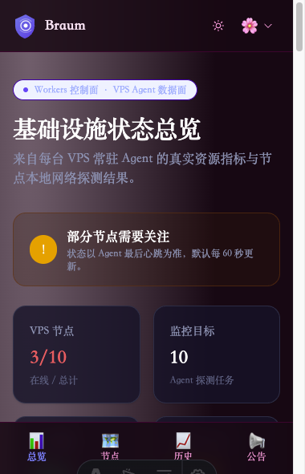
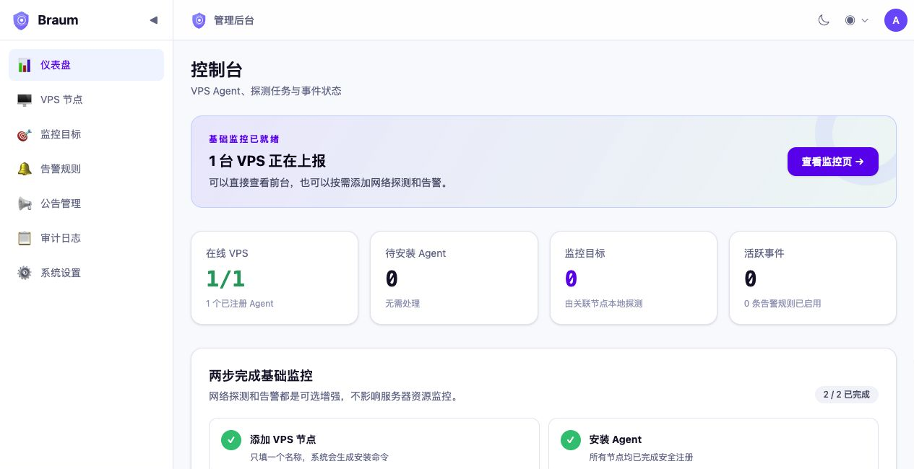

<p align="center">
  
</p>

<h1 align="center">Braum 布隆探针</h1>

<p align="center">
  <strong>一个 Cloudflare Worker，即可拥有轻量的 VPS 资源监控与网络探测平台</strong>
</p>

<p align="center">
  
  
  
  
  <a href="https://github.com/elite-silab/braum-probe/actions/workflows/ci.yml"></a>
  
</p>

## 为什么选择 Braum？

- **只部署一个 Worker**：网站、管理后台、API、Agent 接口和 Cron 共用一个地址与一份配置。
- **无需控制面 VPS**：Next.js、Hono、D1 和 KV 全部运行在 Cloudflare。
- **Agent 主动外连**：VPS 只通过出站 HTTPS 上报，不需要开放 Agent 端口。
- **节点本地探测**：HTTP/DNS 任务在 VPS 上执行，真实反映不同地区的网络质量。
- **添加节点简单**：后台只填节点名称，即可生成 15 分钟有效的一次性安装命令。
- **轻量易维护**：单文件 Go Agent、自动数据库迁移、自动聚合与数据清理。

## 功能

- 首页直接展示 VPS 完整系统、CPU、内存、磁盘、实时网速、累计流量和运行时间
- `braum-agentctl` 数字菜单管理 Agent：状态、日志、启停、在线更新与卸载
- HTTP/DNS 节点本地探测、延迟趋势与可用率
- 一次性 Agent 注册令牌与节点独立密钥
- CPU、内存、磁盘、负载、心跳、延迟和连续失败告警
- Telegram 与 Webhook 通知
- 故障公告、事件时间线和公开状态页
- Owner / Admin / Viewer 权限与审计日志
- 四套主题和独立暗色模式

## 截图

| 状态首页 | 管理后台 |
|:---:|:---:|
|  |  |

## 架构

```text
浏览器 ───────────────┐
                     ▼
VPS Agent ──HTTPS──▶ braum-probe Worker
                     ├─ Next.js 状态页 / 管理后台
                     ├─ Hono API / Agent 接口
Cloudflare Cron ────▶ ├─ 定时告警 / 聚合 / 清理
                     └─ D1 + KV
```

唯一生产地址同时提供：

- 网站：`https://braum-probe.codeelite.workers.dev`
- 管理后台：`https://braum-probe.codeelite.workers.dev/admin`
- 健康检查：`https://braum-probe.codeelite.workers.dev/health`
- API 与 Agent：同一域名下的 `/api/*`

## 技术栈

| 层级 | 技术 | 作用 |
|:---|:---|:---|
| 全栈 Worker | Cloudflare Workers + OpenNext | 单 Worker 运行完整应用 |
| 前端 | Next.js App Router + React + Tailwind CSS | 状态页与管理后台 |
| API | Hono | 鉴权、节点、探测、告警与 Agent 接口 |
| 数据 | Cloudflare D1 + KV | 持久数据、缓存与限流状态 |
| Agent | Go | VPS 资源采集与本地网络探测 |

## 快速部署

> 你只需要 GitHub、Cloudflare 和一台要监控的 Linux VPS。生产部署可以全部在网页中完成。

### 1. Fork 并发布 Agent

1. Fork 本仓库。
2. 打开 Fork 后仓库的 **Actions → Agent Release → Run workflow**。
3. 等待工作流变绿，确认 **Releases** 中出现 amd64、arm64 和对应 `.sha256` 文件。

### 2. 创建 D1 与 KV

在 Cloudflare 控制台创建：

| 资源 | 名称 | 复制内容 |
|---|---|---|
| D1 | `braum-production` | Database ID |
| KV | `braum-cache` | Namespace ID |

### 3. 编辑唯一配置

在 GitHub 网页打开根目录 `wrangler.jsonc`，点击铅笔按钮，修改：

- `AGENT_API_URL`：你的 Worker 完整 HTTPS 地址；
- `AGENT_RELEASE_BASE_URL`：你的 GitHub Release 下载地址；
- `database_id`：刚创建的 D1 ID；
- KV 的 `id`：刚创建的 KV ID。

Cloudflare 的 Workers 子域可在控制台中查看。Worker 名称保持 `braum-probe` 时，地址格式通常是：

```text
https://braum-probe.你的Workers子域.workers.dev
```

### 4. 创建唯一 Worker

进入 **Cloudflare → Workers & Pages → Create → Import from Git**，选择 Fork 后的仓库：

| 设置 | 值 |
|---|---|
| Project name | `braum-probe` |
| Production branch | `main` |
| Root directory | 留空，使用仓库根目录 |
| Build command | `pnpm --filter @braum/web build:worker` |
| Deploy command | `pnpm --filter @braum/web deploy:worker` |
| Node.js | `22.12.0` 或更新的 22.x |

这里必须创建 **Worker**，不要选择 Pages，也不要填写 Build output directory。

### 5. 填写生产密钥

进入这个 Worker 的 **Settings → Variables and Secrets**，添加四个加密 Secret：

| 名称 | 内容 |
|---|---|
| `JWT_SECRET` | 密码管理器生成的随机长字符串 |
| `JWT_REFRESH_SECRET` | 另一个不同的随机长字符串 |
| `ENCRYPTION_KEY` | 再一个不同的随机长字符串 |
| `ADMIN_INITIAL_PASSWORD` | 管理后台初始密码 |

保存后重新部署一次。不要把这些生产密钥写入仓库。

### 6. 登录并安装 Agent

1. 打开 Worker 地址的 `/admin`。
2. 邮箱使用 `admin@braum.local`，密码使用刚设置的 `ADMIN_INITIAL_PASSWORD`。
3. 进入「VPS 节点」并添加节点，只需填写名称。
4. 复制后台生成的安装命令，在被监控 VPS 上执行。
5. 等待约一分钟，节点会开始上报资源和探测数据。

安装完成后，在 VPS 执行 `sudo braum-agentctl` 即可通过数字菜单查看状态和日志、启停、在线更新或卸载 Agent，不需要记忆 systemd 命令。

完整网页步骤和常见问题见 [小白部署指南](docs/小白部署指南.md)。

## 本地开发

```bash
git clone https://github.com/elite-silab/braum-probe.git
cd braum-probe
pnpm install
cp .env.example .env
pnpm dev
```

直接编辑根目录 `.env` 即可调整本地密码或 Agent 地址。`pnpm dev` 会通过 `predev` 自动执行本地 D1 migration。

- 网站：`http://localhost:3000`
- 管理后台：`http://localhost:3000/admin`
- 健康检查：`http://localhost:3000/health`
- API：同一地址下的 `/api/*`

## 项目结构

```text
worker.ts            # 唯一 Cloudflare Worker 入口
wrangler.jsonc       # 唯一生产配置
apps/
├── api/             # Hono API、Cron 与 D1 migrations
├── agent/           # Go VPS Agent
└── web/             # Next.js App Router 前端
packages/shared/     # TypeScript 共享类型
docs/                # 架构、部署和交互文档
```

## 安全

- Agent 密钥只返回一次，D1 仅保存 SHA-256 摘要。
- 通知渠道配置使用 AES-GCM 加密。
- 管理操作使用三级 RBAC 并写入脱敏审计日志。
- HTTP 探测目标保存前执行私网和回环地址检查。
- 建议使用 Cloudflare Access 对 `/admin` 增加额外保护。

## 文档

| 文档 | 说明 |
|:---|:---|
| [小白部署指南](docs/小白部署指南.md) | 纯网页生产部署 |
| [Agent 使用指南](docs/Agent使用指南.md) | VPS 安装、升级、卸载与排障 |
| [部署运维文档](docs/部署运维文档.md) | 开发者部署、备份和排障 |
| [架构设计](docs/架构设计文档.md) | 单 Worker 与 VPS Agent 架构 |
| [环境变量](docs/环境变量与配置指南.md) | 本地与生产配置边界 |
| [数据库设计](docs/数据库设计文档.md) | D1 Schema 与迁移 |
| [管理后台](docs/管理后台功能和设计文档.md) | 后台功能与交互 |

## 质量检查

```bash
pnpm test
pnpm typecheck
pnpm lint
pnpm build
```

## 协议

[MIT](LICENSE) — 欢迎使用、修改、Issue 和 Pull Request。
