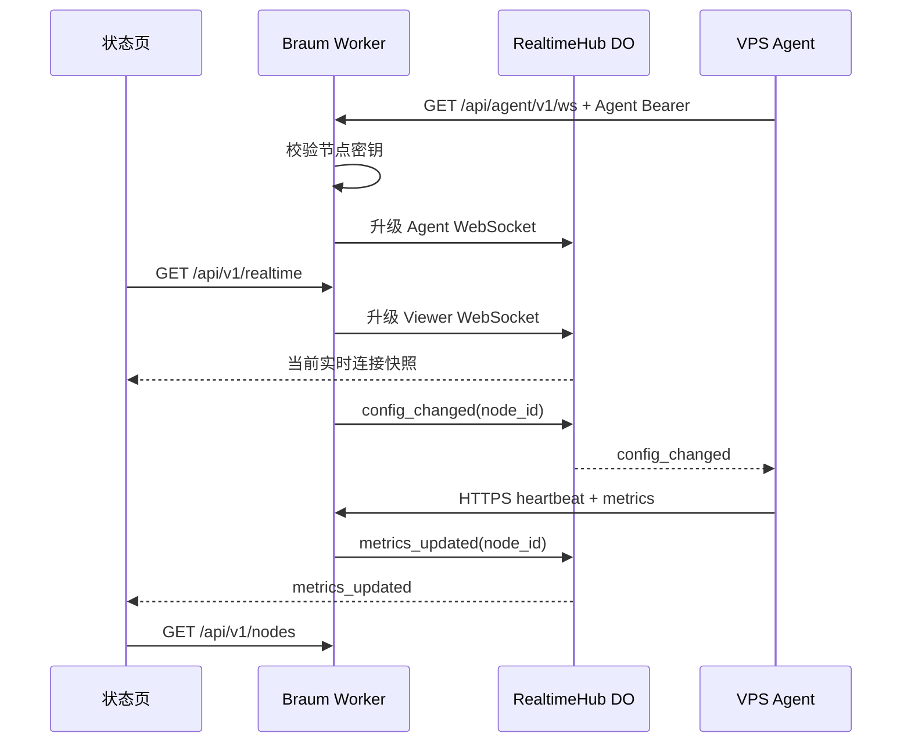

# WebSocket 实时控制通道设计

> 状态：已确认 · 2026-07-27

## 目标

在不改变 Braum 单 Worker、轻量部署和 HTTPS 可靠上报模型的前提下，增加 Agent 与控制面的双向实时通道。第一阶段只承载连接状态、配置变更通知和立即上报指令，不开放远程终端。

## 方案

- 资源指标、注册、探测结果和历史查询继续使用 HTTPS。
- Agent 从现有 `server` 自动推导 `ws://` 或 `wss://` 地址，不增加用户配置项。
- 单个 `RealtimeHub` Durable Object 使用 WebSocket Hibernation API 管理 Agent 和公开状态页连接。
- Agent 通过节点长期密钥完成 WebSocket 握手鉴权；长期密钥不会发送给浏览器或 Durable Object。
- 节点或监控目标发生变更时，API 只发送 `config_changed` 指令，Agent 随即通过 HTTPS 心跳拉取完整配置。
- Agent 完成心跳后，控制面向浏览器广播轻量事件；浏览器收到事件后重新读取公开 API，不在 WebSocket 中传输完整指标。
- 30 秒轮询保留为降级路径，WebSocket 中断不影响监控数据上报。

## 连接与事件

## 安全边界

- Agent 升级请求复用现有节点密钥鉴权与速率限制。
- 浏览器连接只接收节点 ID 和事件类型；完整指标仍由公开只读 API 返回。
- Durable Object 内部通知入口不暴露为公共 Worker 路由。
- 单条消息限制为 16 KiB，只接受已知事件，不执行任意命令。
- 新连接替换同一节点的旧连接，凭据吊销时主动断开连接。
- 本阶段不传输 Shell、文件、日志或用户输入。

## 可靠性与成本

- Agent 采用带抖动的指数退避重连，最长等待 60 秒。
- 应用层每 25 秒发送一次 `ping`，Durable Object 返回 `pong`。
- Durable Object 使用休眠 WebSocket，空闲时不保持活跃计算。
- 浏览器断线后自动重连，同时保留 30 秒轮询作为兜底。
- Durable Object 不保存监控事实数据；D1 仍是唯一事实来源。

## 用户配置

用户无需填写 WebSocket URL、端口、证书或 Durable Object ID。仓库中的 `wrangler.jsonc` 预置绑定和迁移；用户只需正常部署 Worker，并确保 VPS 可以出站访问 TCP 443。

## 后续边界

远程终端必须另行完成威胁建模、短时会话票据、二次确认、会话吊销、权限检查和完整审计。本设计不会因为具备 WebSocket 通道而自动开放终端能力。
