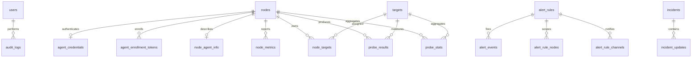

# Braum D1 数据库设计

> 版本：v2.0 · 更新：2026-07-25 · 事实来源：`apps/api/migrations/*.sql`

## 1. 设计原则

- D1 是配置和历史数据的事实来源；最新探测结果直接使用已有索引查询，避免高频写入 KV。
- Agent 注册令牌和长期密钥只保存 SHA-256 摘要。
- 节点删除通过外键级联清理 Agent 与资源数据。
- 时间统一存 ISO 8601 UTC；范围查询使用 `julianday()`，避免空格/T 格式比较误差。
- 原始时序数据短期保存，长期依赖小时/日聚合。

## 2. 实体关系



## 3. 核心与 Agent 表

### `nodes`

VPS 资产与管理员配置。`last_heartbeat_at` 只能由 Agent 注册/心跳更新，中心探测不能更新。`status` 为 `active | paused | offline`；是否待安装通过是否存在 `agent_credentials` 推导。

### `agent_enrollment_tokens`

| 字段 | 说明 |
|---|---|
| `id` | 随机记录 ID |
| `node_id` | 单节点作用域，级联删除 |
| `token_hash` | 一次性令牌 SHA-256，唯一 |
| `expires_at` | 默认创建后 15 分钟 |
| `used_at` | 成功消费时间；非空后拒绝复用 |
| `created_by` | 创建管理员 |

### `agent_credentials`

每节点最多一个长期凭据。`secret_hash` 唯一；重新注册使用 Upsert 轮换。`last_used_at` 用于后台排障。

### `node_agent_info`

保存 hostname、OS、发行版、内核、架构、CPU、核心数、虚拟化、Agent 版本、服务端观察到的公网 IP 和 Agent 报告的私网 IP。公共 API不返回 IP 字段。

### `node_metrics`

| 类别 | 字段 |
|---|---|
| CPU/负载 | `cpu_usage`, `load_1`, `load_5`, `load_15` |
| 内存 | used/total memory 与 Swap 字节数 |
| 磁盘 | used/total 字节数 |
| 网络 | 累计 RX/TX 字节、TCP 连接数 |
| 系统 | 进程数、运行秒数 |
| 时间 | `collected_at`, `received_at` |

约束保证百分比 0–100、所有计数非负。索引 `(node_id, collected_at DESC)` 支持节点最新样本和趋势查询。

## 4. 探测表

- `targets`：HTTP/DNS 地址、期望状态、超时和启停状态。
- `node_targets`：决定心跳向 Agent 下发哪些目标，也是结果上报的授权边界。
- `probe_results`：节点本地执行的原始结果。
- `probe_stats`：小时/日可用率与延迟分位数。

Agent 上报结果时服务端必须验证 `node_targets` 关联，不能只相信请求中的 `target_id`。

## 5. 告警、事件和审计

`alert_rules.metric` 支持：

```text
availability, latency_ms, consecutive_failures,
cpu_usage, memory_usage, disk_usage, load_1, heartbeat_age_seconds
```

迁移 `0006_agent_resource_alerts.sql` 在保留规则、节点/渠道关联和事件的同时扩展 CHECK 约束。

通知渠道配置写入 `alert_channels.config` 前使用 AES-GCM 加密。`audit_logs.changes` 通过统一工具递归脱敏。

## 6. 迁移顺序

| 文件 | 内容 |
|---|---|
| `0001_init_core.sql` | 用户、节点、目标、探测与设置 |
| `0002_init_alerts.sql` | 告警规则、渠道与事件 |
| `0003_init_incidents.sql` | 公告和时间线 |
| `0004_init_audit.sql` | 审计日志 |
| `0005_init_agents.sql` | Agent 注册、凭据、主机信息和资源指标 |
| `0006_agent_resource_alerts.sql` | Agent 资源与心跳告警指标 |

禁止修改已在生产应用的迁移文件；后续变更必须新增编号迁移并加入真实 SQLite 契约测试。

## 7. 默认保留策略

| 数据 | 时间 |
|---|---|
| `node_metrics` | 7 天 |
| `probe_results` | 30 天 |
| `probe_stats` | 90 天 |
| `audit_logs` | 90 天 |
| 已过期注册令牌 | 过期后额外 1 天 |
