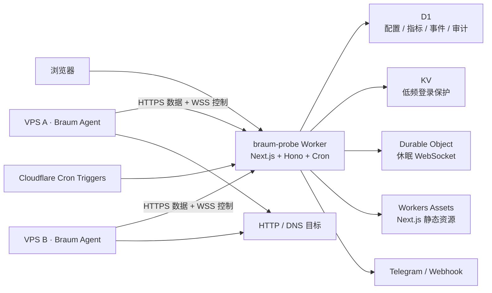
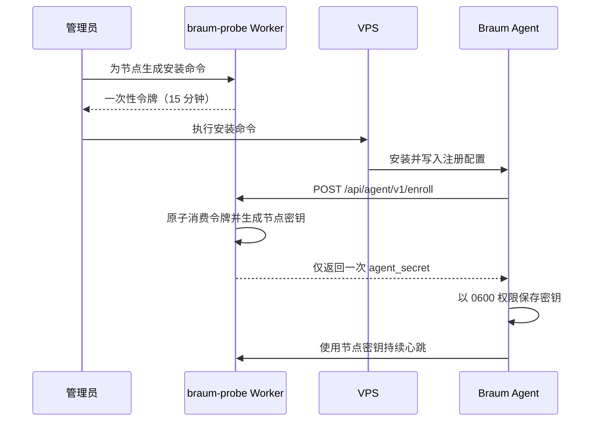

# Braum 布隆探针架构设计

> 文档版本：v3.0 · 更新日期：2026-07-27

## 1. 产品定位

Braum 是一个以 Cloudflare 单 Worker 为控制面、以轻量 Go Agent 为数据面的 VPS 监控平台。它监控真实 VPS 资源，并从每台 VPS 本地执行 HTTP/DNS 探测，不把 Cloudflare Cron 伪装成监控节点。

## 2. 高层架构

## 3. 单 Worker 请求分流

根入口 `worker.ts` 负责分流：

| 请求或事件 | 处理方 |
|---|---|
| `/health`、`/api/*` | Hono |
| 页面与 Next.js 资源请求 | OpenNext Worker |
| `scheduled` | Hono 调度器 |

网站与 API 同源，因此浏览器不需要生产 API 地址变量或跨域授权。D1、KV、Durable Object、Secrets、Cron 和 Assets 只绑定一次。

## 4. 组件职责

### Next.js 展示层

- App Router 提供公开状态页、节点详情、历史数据和管理后台。
- React Client Components 负责实时刷新、表单、主题与 JWT 会话。
- 状态页通过同源 WebSocket 接收变化事件，完整数据仍从公开 API 读取，并保留 30 秒轮询兜底。
- 公开详情页按请求读取 API，不把 D1 绑定暴露给浏览器。

### Hono 控制面

- Owner/Admin/Viewer 登录、鉴权与权限控制。
- 节点、目标、告警、公告、用户和审计管理。
- 创建一次性 Agent 注册令牌与安装命令。
- 校验 Agent 身份并接收心跳、指标和探测结果。
- 执行告警评估、小时/日聚合、心跳检查和数据清理。

### Braum Agent

- 以低权限 systemd 服务运行。
- 通过一次性令牌注册并保存节点独立密钥。
- 采集 CPU、内存、Swap、磁盘、负载、流量和主机信息。
- 获取目标配置，在 VPS 本地执行 HTTP/DNS 探测。
- 网络失败时指数退避，不要求 VPS 开放入站端口。
- 自动维护 WSS 控制连接；收到配置变化后立即执行一次 HTTPS 心跳。

## 5. Agent 注册流程

## 6. 节点状态

| 状态 | 判定 |
|---|---|
| 在线 | 最近心跳未超过 `max(3 × 上报周期, 180 秒)` |
| 离线 | 超过阈值且节点未暂停 |
| 暂停 | 管理员主动暂停 |
| 待注册 | 节点已创建但 Agent 尚未注册 |

## 7. 数据与可靠性

- D1 是配置、历史指标、探测结果、告警和审计的事实来源。
- KV 仅用于低频登录接口的分布式限流；额度异常时自动降级为 Worker isolate 内存限流，不得阻断 Agent 心跳或公开状态读取。
- Durable Object 只管理当前 WebSocket 连接和轻量通知，不保存监控事实数据。
- Agent 网络异常时指数退避；恢复后自动继续上报。
- Worker 失败不会让 Agent 开放端口或暴露长期密钥。
- 原始资源指标默认保留 7 天，探测结果 30 天，聚合和审计 90 天。

## 8. WebSocket 实时控制通道

- Agent 使用节点长期密钥在 Worker 路由完成握手鉴权，Durable Object 不接收密钥。
- WebSocket 只传输连接状态、配置变化和数据更新事件，不传输完整资源指标。
- 节点或目标变化时 Agent 立即心跳拉取新配置；实时通道故障时仍按原周期获取。
- 同一节点的新连接替换旧连接，凭据吊销和节点删除会主动断开连接。
- Agent 与浏览器都自动重连，用户不填写 WebSocket 地址或 Durable Object ID。

## 9. 远程终端边界

远程终端不属于普通心跳协议。后续实现必须使用短期会话票据、Agent 主动 WebSocket、管理员二次确认、会话吊销和完整审计，并默认关闭。

## 10. 非功能目标

| 类别 | 目标 |
|---|---|
| Agent 开销 | 空闲内存 < 30 MB；平均 CPU < 1% |
| 数据新鲜度 | 默认 60 秒并显示最后采集时间 |
| 安全 | TLS、摘要存储、一次性注册、RBAC、审计 |
| 兼容性 | Linux amd64/arm64 |
| 部署 | 一个 Worker、一份 Wrangler 配置、一次 Git 集成 |
