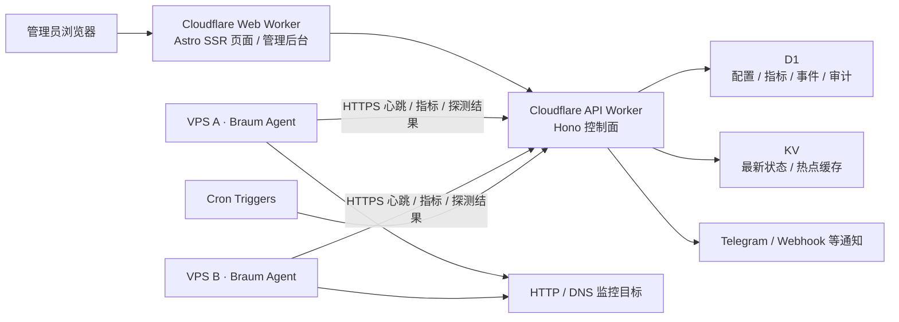
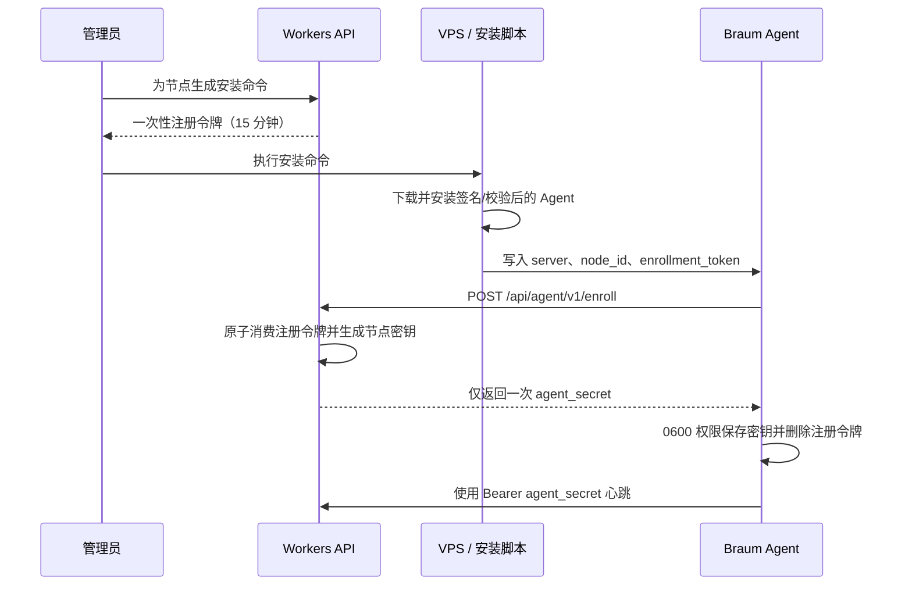

# Braum 布隆探针架构设计

> 文档版本：v2.0
> 更新日期：2026-07-25

## 1. 产品架构定位

Braum 是一个以 Cloudflare 为控制面、以轻量 Agent 为数据面的 VPS 监控平台。它不是纯外部拨测服务，也不会把 Cloudflare Cron 的执行位置伪装成用户 VPS。

核心能力分为三层：

1. **资产监控**：Agent 上报 VPS 在线状态、CPU、内存、磁盘、负载、流量和主机信息。
2. **网络探测**：Agent 从所在 VPS 执行 HTTP/DNS 任务，形成真实的多地域观测结果。
3. **控制与展示**：API Worker 接收数据并执行鉴权、配置、告警和聚合；Web Worker 提供 Astro SSR 公共状态页与管理后台。

## 2. 高层架构

## 3. 组件职责

### 3.1 Workers 控制面

- Owner/Admin/Viewer 权限与登录会话。
- 节点资产、探测目标、告警规则和事件公告管理。
- 创建一次性 Agent 注册令牌和安装命令。
- 校验 Agent 身份、接收心跳、资源指标与探测结果。
- 向 Agent 下发该节点已关联且启用的探测目标。
- 汇总小时/日统计，检查心跳超时，发送告警通知。
- 对敏感操作写入审计日志。

### 3.2 Braum Agent

- 以低权限 systemd 服务常驻 VPS。
- 首次启动通过一次性令牌注册并安全保存节点密钥。
- 采集 CPU、内存、Swap、磁盘、系统负载、网络累计流量和运行时间。
- 获取控制面下发的 HTTP/DNS 任务并在本机执行。
- 按服务端返回的间隔上报；网络失败时指数退避，不无限占用磁盘。
- 上报 Agent 版本、OS、架构等信息，为升级和兼容性检查提供依据。

### 3.3 D1 与 KV

- D1 是配置、历史指标、探测结果、告警和审计的事实来源。
- KV 只保存可重建的最新状态与热点数据，不作为唯一持久化存储。
- 原始资源指标默认保留 7 天，小时聚合保留 90 天；实际值可通过系统设置调整。

## 4. Agent 注册流程

## 5. 心跳与探测协议

Agent 每个采集周期执行：

1. 采集主机信息与资源指标。
2. 调用 `POST /api/agent/v1/heartbeat`。
3. 服务端验证节点密钥，写入指标，更新节点最后心跳并返回目标配置。
4. Agent 在 VPS 本地执行目标探测。
5. 调用 `POST /api/agent/v1/probe-results` 批量上报结果。

节点状态定义：

| 状态 | 判定 |
|---|---|
| 在线 | 最近心跳未超过 `max(3 × 上报周期, 180 秒)` |
| 离线 | 超过心跳阈值且节点未暂停 |
| 暂停 | 管理员主动暂停，不接受普通监控任务 |
| 待注册 | 已创建节点但从未完成 Agent 注册 |

## 6. 远程终端边界

远程终端技术上可行，但不属于普通心跳协议。推荐使用：

- 管理员二次确认并申请 60 秒有效的一次性会话票据。
- Agent 主动建立到 Durable Object 或专用中继的 WebSocket。
- Worker 校验 Owner/Admin 权限和节点授权，绝不把永久 Agent 密钥暴露给浏览器。
- 终端连接、断开、操作者、来源 IP、节点和持续时间全部审计。
- 默认关闭，可通过环境变量与节点策略显式启用。

P0 只实现安全注册、资源监控和网络探测。远程终端在完成威胁建模、会话吊销、速率限制和审计测试后进入 P1。

## 7. 非功能要求

| 类别 | P0 目标 |
|---|---|
| Agent 开销 | 空闲内存 < 30 MB；平均 CPU < 1% |
| 心跳 API | 正常负载下 p95 < 500 ms |
| 数据新鲜度 | 默认 60 秒，页面明确显示最后心跳时间 |
| 安全 | TLS、摘要存储、一次性注册、RBAC、审计、输入限制 |
| 可靠性 | Agent 网络故障指数退避；控制面恢复后自动重连 |
| 兼容性 | Linux amd64/arm64 为 P0；其他平台后续扩展 |
| 可维护性 | Agent 与服务端协议带版本字段，保持至少一个次版本兼容 |

## 8. 主要失败模式

| 失败 | 用户影响 | 缓解措施 |
|---|---|---|
| Worker 或网络暂时不可达 | 指标短暂缺口 | Agent 指数退避；页面显示数据新鲜度 |
| D1 写入失败 | 当前周期数据丢失 | 返回非 2xx，Agent 下一周期恢复；结构化错误日志 |
| Agent 密钥泄漏 | 攻击者伪造单节点上报 | 后台一键吊销/重新注册；密钥只授权单节点 |
| 注册命令泄漏 | 令牌有效期内可能抢先注册 | 15 分钟过期、仅用一次、成功注册后立即失效 |
| Agent 版本过旧 | 指标或协议不兼容 | 心跳返回最低版本提示；后台显示升级状态 |
| 指标写入过多 | 超出 D1 配额 | 最短上报间隔、批量聚合、分层保留策略 |
